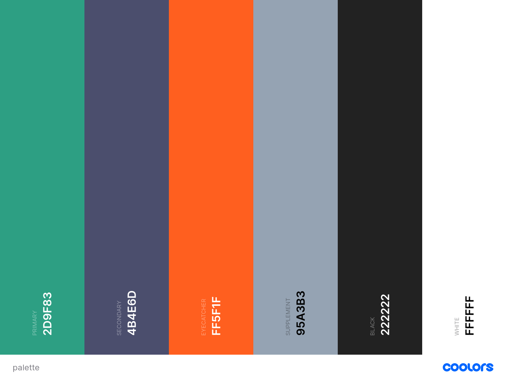

# vlinder-branding color palette

The vlinderapp uses a color palette which consists out of a primary, a secondary and an 'eye-catcher' color. These three build the foundation of any
color combination used in both the mobile application, the web application and the social media branding. Besides the three main colors, vlinder also
choose a supplementary color that serves as a bridge between the primary and secondary color.

The palette consist out of the following colors and can be checked out online [here](https://coolors.co/2d9f83-4b4e6d-ff5f1f-95a3b3-222222-ffffff):

